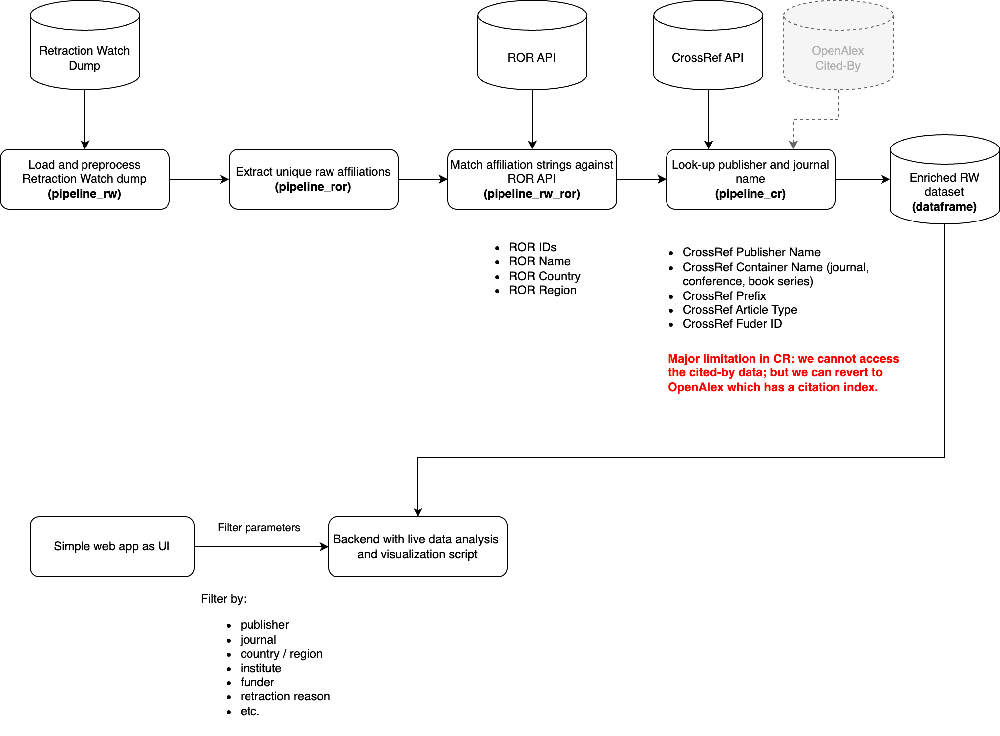

# CrossRef Metadata Sprint 2025, Madrid

This is repository with the outcomes of a 2-day hackathon at the CrossRef Metadata
Sprint 2025 in Madrid, Spain. Due the obvious time constraints, the artefacts are
very much prototypical.

## Retractions Data Analysis

Goal: Connect Retraction Watch (RW) data set with metadata from CrossRef, ROR,
OpenAlex, etc.; to e.g. analyze the doi prefixes citing retracted papers pre- and
post-retraction; analyze evolution of the number of retractions per prefix / publisher
/ journal / institute / funder / country / region; etc.



## Running the Analysis

### Prerequisites

Have a local copy of ROR-API running via Docker: https://github.com/ror-community/ror-api#readme

### Setup Your Local Environment

1. Clone the repository
1. Active venv environment:
   ```bash
   source .venv/bin/activate
   ```
1. Install the Python dependencies:
   ```bash
   pip install -r requirements.txt
   ```

### Runing the Pipelines

1. Run the pipeline to ETL the RW data set:
   ```bash
   python src/pipeline_rw.py
   ```
1. Sample the RW date set (optional):
   ```bash
   python src/pipeline_sample.py
   ```
1. Run the pipeline to match ROR IDs for affiliations:
   ```bash
   python src/pipeline_ror.py
   ```
1. Merge back ROR data into the RW data set:
   ```bash
   python src/pipeline_rw_ror.py
   ```
1. Fetch CrossRef data for the RW data set:
   ```bash
   python src/pipeline_cr.py
   ```

### Running the Web App

1. Run the web app:
   ```bash
   fastapi dev src/app.py
   ```
   Then open the browser at `http://localhost:8000/` to see the prototype analysis UI.

## Limitations / Possible Improvements

We use ROR API first returned item for affiliation matching, which is strongly advised against
by the ROR documentation. We should use a proper machine learning model to match the affiliations
with RORs instead, such as the one used in OpenAlex.

### Possible improvements:

1. Affiliation matching from ROR: using a Machine Learning model such as those employed by OpenAlex
1. Funder data from CrossRef: we use the first item returned by the CrossRef works API, but do not follow
   funder hierarchy. Ideally we should use the hierarchy data so that retractions can be reconciliated on
   higher funder levels (such as a national funder level).
1. Solution performance and scaling:
   1. We do lots of API-based look-ups, which may fail with non 200 http codes for various reasons (not robust and not performant):
      1. Matching affiliations locally instead of via ROR API to scale the solutions to larger dataset
      1. Matching CrossRef metadata locally from the public dump file instead of via the CrossRef API
1. Load cited-by data from CrossRef (or alternatively OpenAlex) to create a second enriched dataset of “papers citing retractions”.
   1. Idea: create a weighted citation factor per paper / author / journal based only on citations to retracted papers (the further away the retracted paper, the more discounted: direct citation paper → retracted paper; discounted citation paper → paper → retracted paper, etc.)
1. Some retractions’ original paper DOI are not registered by CrossRef but by other registration agencies such as DataCite or mEDRA (example).
1. Load the dataset into a ElasticSearch or Solr index for better query / facet-based refinement and analysis based on user’s input.
1. Write proper pipelines in proper Python 😅

## Notes

General note: articles in RW may not have a DOI that is registered in CrossRef.
We need to check if the DOI is registered in CrossRef.

Data fields in Retraction Watch (RW) data set:

1. **subject**: subject seems not easily usable; may need a subject classification API
1. **institution**: this piece of data might not be present in CrossRef, so we can take
   it from the RW data set. We need to match it again ROR API to get the institution's
   main ROR ID.
1. **journal** and **publisher**: we should not rely on RW data for this but the from
   CrossRef.
1. **country**: we ignore this piece of information as we will infer it from the
   institution's ROR record.
1. **author**: we can take from CrossRef data set.
1. **urls**: needs preprocessing as may contain multiple URLs. Contains URL to Retraction
   Watch blog if any.
1. **articletype**: this is the type of the article, which is any of:
   `['Clinical Study', 'Supplementary Materials', 'Auto/Biography', 'Interview/Q&A', 'Expression of Concern', 'Book Chapter/Reference Work', 'Case Report', 'Trade Magazines', 'Conference Abstract/Paper', 'Correction/Erratum/Corrigendum', 'Dissertation/Thesis', 'Preprint', 'Meta-Analysis', 'Commentary/Editorial', 'Research Article', 'Review Article', 'Article in Press', 'Other', 'Legal Case/Analysis', 'Retraction Notice', 'Technical Report/White Paper', 'Guideline', 'Government Publication', 'Letter', 'Retracted Article', 'Revision']`
   We will use this to filter out the articles we are interested in.
1. **retractiondate**: we keep this info; we need to check if any cited-by publication is
   published after this date. Key data point.
1. **retractiondoi**: this is the DOI of the RETRACTION NOTICE.
1. **originalpaperdoi**: this is the DOI of the articles that has been RETRACTED. Key data
   point.
1. **retractionnature**: type of the retraction, which is any of:
   `['Retraction' 'Correction' 'Expression of concern' 'Reinstatement']`

Data fileds of interest from the ROR dataset:

1. **ror_id**: this is the ROR ID of the institution.
1. **name**: this is the name of the institution.
1. **country**: this is the country of the institution.
1. **region**: this is the country subzone of the institution.

Data fields of interest from the CrossRef dataset:

1. **doi**: this is the DOI of the article.
1. **container**: this is the title of the journal / conference / book series.
1. **publisher**: this is the publisher of the journal / conference / book series.
1. **type**: the publication type (journal-article, preprint, book-chapter, etc.)
